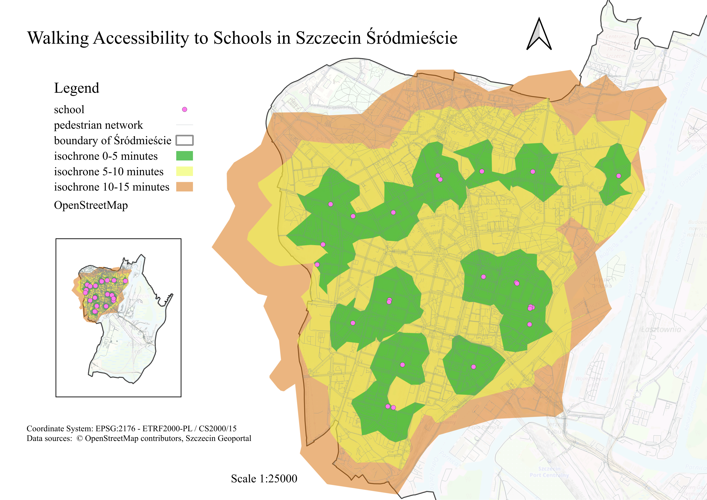

# Walking Accessibility to Schools in Central Szczecin

## Project Description
This project presents an analysis of walking accessibility to schools in the central district of Szczecin using network analysis. The aim was to identify areas that can be reached on foot from schools within 5, 10 and 15 minutes. The analysis was carried out using QGIS, PostgreSQL/PostGIS and pgRouting. The analysis was based on a pedestrian network created from OpenStreetMap data. The walking time for each network segment was calculated based on its length and the assumed walking speed.

## Technologies Used
- PostgreSQL
- PostGIS
- pgRouting
- QGIS

## Data Used
The project uses the following data sources:
- OpenStreetMap – locations of roads and schools
- Szczecin Geoportal – boundaries of the central district

## Methodology

### Data Preparation
The spatial data was imported into a PostgreSQL database using PostGIS and transformed to a common coordinate reference system, EPSG:2176.
Pedestrian-accessible elements of the OpenStreetMap network were selected for the analysis. Data from the planet_osm_roads and planet_osm_line layers were combined and then clipped to the area of the central district with an additional buffer.

### Graph Construction
Based on the prepared network, nodes were created at the endpoints and intersections of the network segments. A bidirectional pedestrian network graph was then created.
A fragment of the graph is shown below.

For each edge, its length and walking time were calculated. The following walking speeds were used:
5 km/h – most roads
4.5 km/h – paths
2.5 km/h – stairs
The walking time was stored in seconds and used as the edge cost in the network analysis.

### Accessibility Analysis
For each school, the nearest graph node was identified. The Dijkstra algorithm in pgRouting was then used to identify nodes that could be reached within 5, 10 and 15 minutes from each school.
Based on the analysis results, walking-time isochrones were created and a final map was prepared in QGIS.

## Final Map

## Limitations
OpenStreetMap data is community-generated, which may affect its completeness and accuracy.
The central district of Szczecin includes not only densely developed urban areas but also water areas, forests and islands where school accessibility is less relevant due to the lack of residential areas. Therefore, the final map focuses on the left-bank part of the district, while a general overview map is provided for the entire central district.

## Conclusions
The analysis made it possible to determine the spatial extent of walking accessibility to schools in the central district of Szczecin for the selected time thresholds of 5, 10 and 15 minutes. The results show that school accessibility varies spatially and depends not only on the distance to a school, but also on the layout and characteristics of the pedestrian network. Using walking time as the edge cost made it possible to account for different walking speeds on different types of infrastructure, including slower movement on stairs. The project demonstrates how OpenStreetMap, PostGIS and pgRouting can be used to perform accessibility analyses based on a real transportation network rather than distance in a straight line.

## Author
Aleksandra Machałowska
