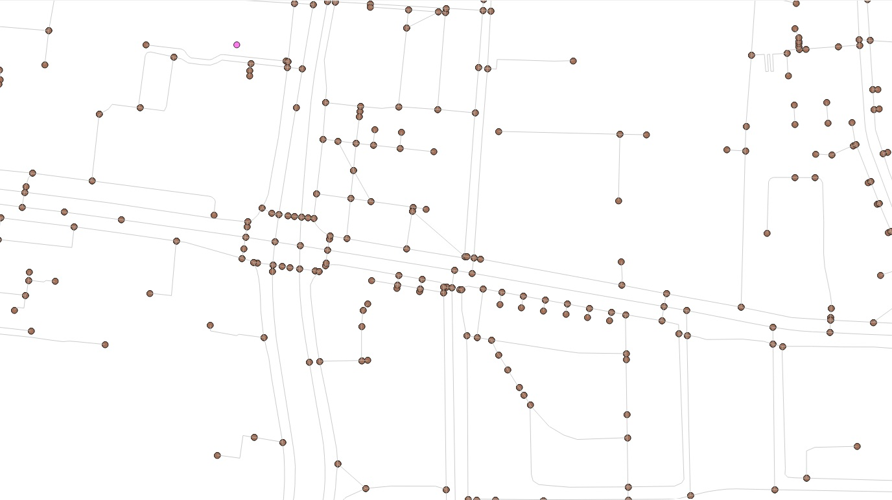
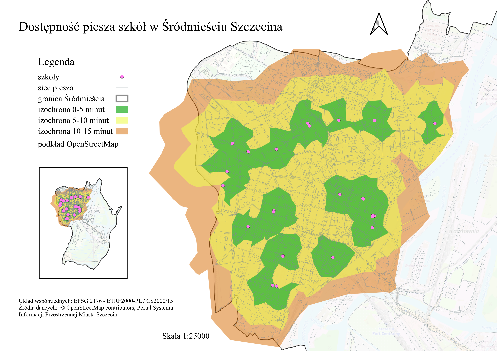

# Analiza dostępności pieszej szkół w Śródmieściu Szczecina

## Opis projektu
Projekt przedstawia analizę dostępności pieszej szkół w dzielnicy Śródmieście Szczecina z wykorzystaniem analizy sieciowej. Celem było określenie obszarów, do których można dotrzeć pieszo ze szkół w czasie 5, 10 i 15 minut. Analizę przeprowadzono z wykorzystaniem QGIS, PostgreSQL/PostGIS oraz pgRouting. Podstawą analizy była sieć piesza utworzona na podstawie danych OpenStreetMap, dla której czas przejścia poszczególnych odcinków określono na podstawie ich długości i przyjętej prędkości poruszania się.

## Wykorzystane technologie

- PostgreSQL
- PostGIS
- pgRouting
- QGIS

## Dane

W projekcie wykorzystano dane:
- OpenStreetMap (lokalizacja sieci dróg, szkół),
- Geoportal Szczecina (granice Śródmieścia).

## Metodyka

### Przygotowanie danych

Dane przestrzenne zaimportowano do bazy PostgreSQL z wykorzystaniem PostGIS i przekształcono do wspólnego układu współrzędnych EPSG:2176.
Z danych OpenStreetMap wyselekcjonowano elementy sieci możliwe do wykorzystania przez pieszych. Dane z warstw planet_osm_roads i planet_osm_line połączono, a następnie przycięto do obszaru Śródmieścia powiększonego o bufor.

### Budowa grafu

Na podstawie przygotowanej sieci utworzono węzły w miejscach końców i przecięć odcinków oraz dwukierunkowy graf sieci pieszej. Fragment utworzonego grafu przedstawiono poniżej.

Dla każdej krawędzi obliczono jej długość oraz czas przejścia. Przyjęto następujące prędkości: 
5 km/h – większość dróg,
4,5 km/h – ścieżki,
2,5 km/h – schody.
Czas przejścia został zapisany w sekundach i wykorzystany jako koszt pokonania krawędzi w analizie sieciowej.

### Analiza dostępności

Dla każdej szkoły znaleziono najbliższy węzeł grafu. Następnie z wykorzystaniem algorytmu Dijkstra w pgRouting wyznaczono węzły osiągalne w czasie do 5, 10 i 15 minut od każdej szkoły.
Na podstawie wyników analizy utworzono izochrony czasu dojścia i przygotowano mapę wynikową w QGIS.

## Mapa wynikowa

## Ograniczenia

Należy uwzględnić, że dane OpenStreetMap mają charakter społecznościowy, co może wpływać na ich kompletność i aktualność.  
Dzielnica Śródmieście Szczecina obejmuje tereny leżące w ścisłym centrum miasta, jak również tereny wód, lasów i wysp, dla których dostępność szkół z powodu niezamieszkania nie jest istotna. Dlatego też mapa wynikowa skupia się na lewobrzeżnej części dzielnicy, zachowując mapę poglądową dla całości Śródmieścia.

## Wnioski

Przeprowadzona analiza pozwoliła określić przestrzenny zasięg dostępności pieszej szkół w Śródmieściu Szczecina dla przyjętych progów czasowych 5, 10 i 15 minut.
Wyniki pokazują, że dostępność szkół jest zróżnicowana przestrzennie i zależy nie tylko od odległości od szkoły, ale również od przebiegu oraz charakteru sieci pieszej. Zastosowanie czasu przejścia jako kosztu krawędzi pozwoliło uwzględnić różne prędkości poruszania się po poszczególnych typach infrastruktury, w tym wolniejsze pokonywanie schodów.
Projekt pokazuje możliwość wykorzystania danych OpenStreetMap, PostGIS i pgRouting do przeprowadzania analiz dostępności opartych na rzeczywistej sieci komunikacyjnej, a nie wyłącznie na odległości w linii prostej.

## Autor

Aleksandra Machałowska
